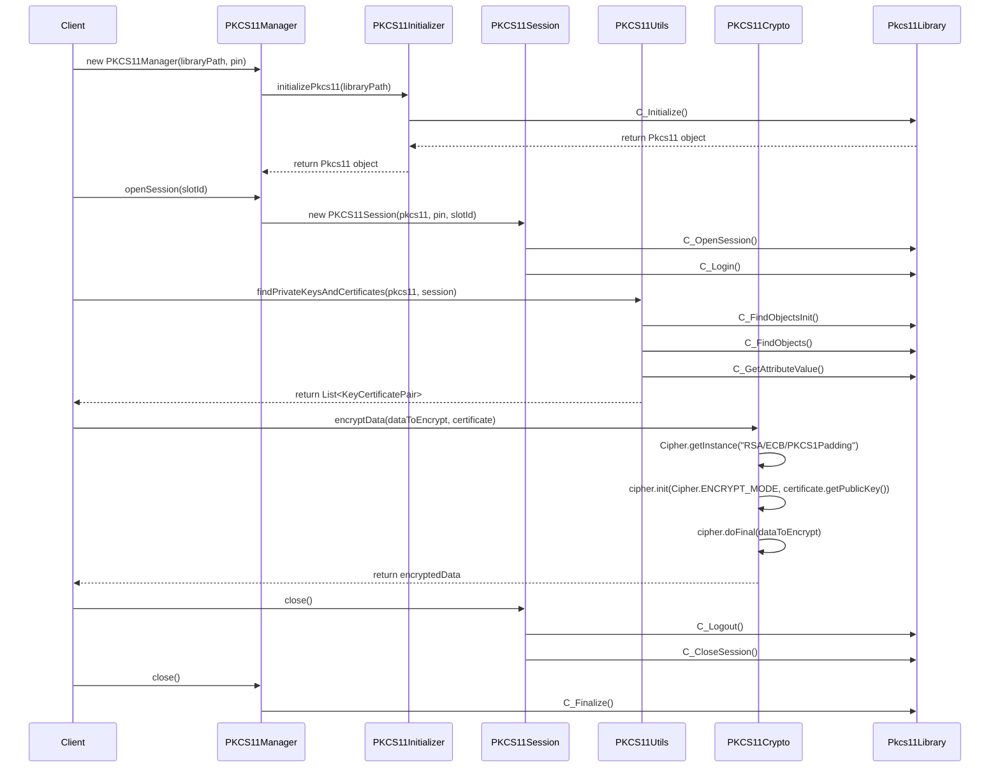
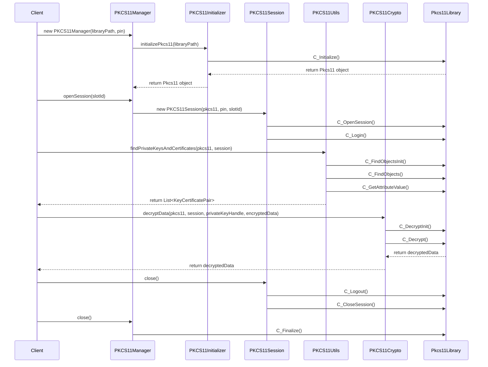
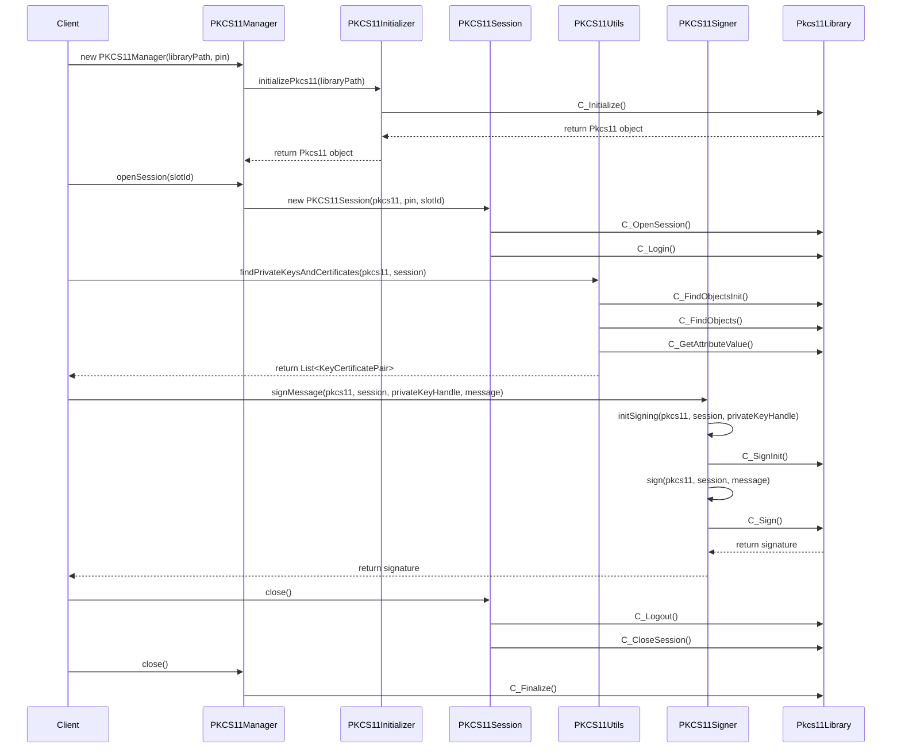
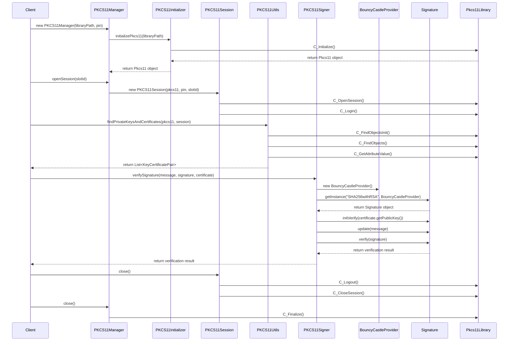

# 🔐 PKCS11 Java Wrapper

## 📚 Table of Contents
- [Introduction](#introduction)
- [Features](#features)
- [Project Structure](#project-structure)
- [Getting Started](#getting-started)
    - [Prerequisites](#prerequisites)
    - [Installation](#installation)
- [Usage](#usage)
    - [Basic Example](#basic-example)
    - [Detailed Examples](#detailed-examples)
        - [Listing Certificates](#listing-certificates)
        - [Signing a Message](#signing-a-message)
        - [Encrypting and Decrypting Data](#encrypting-and-decrypting-data)
        - [Listing Supported Algorithms](#listing-supported-algorithms)
- [Architecture](#architecture)
    - [Class Diagrams](#class-diagrams)
    - [Sequence Diagrams](#sequence-diagrams)
- [Tested Environments](#tested-environments)
- [Testing](#testing)
- [Contributing](#contributing)
- [License](#license)
- [Contact](#contact)

## 🌟 Introduction

Welcome to the PKCS11 Java Wrapper! This comprehensive Java library provides a robust and user-friendly interface for interacting with PKCS#11 (also known as Cryptoki) compatible hardware security modules (HSMs) and smart cards. Our project aims to simplify cryptographic operations while maintaining the highest security standards.

## 🚀 Features

- 🔒 Secure initialization and management of PKCS#11 sessions
- 🔑 Key and certificate management
- 📝 Digital signature creation and verification
- 🔐 Data encryption and decryption
- 🧰 Utility functions for common PKCS#11 operations
- 🛡️ Comprehensive exception handling for robust error management
- 🧪 Extensive test coverage ensuring reliability

## 📂 Project Structure

```
Root:.
├───lib
│       // OpenSC and other PKCS#11 libraries
├───src
│   ├───main
│   │   ├───java
│   │   │   └───pl
│   │   │       └───mlodawski
│   │   │           └───security
│   │   │               ├───example
│   │   │               │       PKCS11Example.java
│   │   │               └───pkcs11
│   │   │                   │   PKCS11Crypto.java
│   │   │                   │   PKCS11Initializer.java
│   │   │                   │   PKCS11Manager.java
│   │   │                   │   PKCS11Session.java
│   │   │                   │   PKCS11Signer.java
│   │   │                   │   PKCS11Utils.java
│   │   │                   ├───exceptions
│   │   │                   │       // Various exception classes
│   │   │                   └───model
│   │   │                           CertificateInfo.java
│   │   │                           KeyCertificatePair.java
│   │   │                           SupportedAlgorithm.java
│   └───test
│       └───java
│           └───pl
│               └───mlodawski
│                   └───security
│                       └───pkcs11
│                               // Test classes for each main class
```

## 🏁 Getting Started

### Prerequisites

- Java Development Kit (JDK) 21 or higher
- Maven 4.0.0 or higher
- A PKCS#11 compatible hardware security module or smart card
- The appropriate PKCS#11 library for your device (e.g., opensc-pkcs11.dll)

### Installation

1. Clone the repository:
   ```
   git clone https://github.com/SimpleMethod/PKCS11-Java-Wrapper.git
   ```

2. Navigate to the project directory:
   ```
   cd PKCS11-Java-Wrapper
   ```

3. Build the project using Maven:
   ```
   mvn clean install
   ```

## 🖥️ Usage

### Basic Example

Here's a basic example of how to use the PKCS11 Java Wrapper:

```java
import pl.mlodawski.security.pkcs11.*;
import java.nio.file.Paths;

public class PKCS11Example {
    public static void main(String[] args) {
        String userDir = System.getProperty("user.dir");
        PKCS11 example = new PKCS11(
                Paths.get(userDir, "lib", "opensc-pkcs11.dll"),
                "your_pin_here"
        );
        example.run();
    }
}
```

This example initializes the PKCS11 library, opens a session, and provides a menu-driven interface for various PKCS#11 operations.

### Detailed Examples

### Detailed Examples

#### Listing Certificates

```java
private void listCertificates(PKCS11Manager manager, PKCS11Session session) {
    List<KeyCertificatePair> pairs = utils.findPrivateKeysAndCertificates(manager.getPkcs11(), session.getSession());
    System.out.println("\nAvailable certificate-key pairs:");
    for (int i = 0; i < pairs.size(); i++) {
        KeyCertificatePair pair = pairs.get(i);
        CertificateInfo certInfo = pair.getCertificateInfo();
        System.out.printf("%d: Subject: %s, Issuer: %s, Serial: %s, Not Before: %s, Not After: %s, CKA_ID: %s\n",
                i + 1,
                certInfo.getSubject(),
                certInfo.getIssuer(),
                certInfo.getSerialNumber(),
                certInfo.getNotBefore(),
                certInfo.getNotAfter(),
                pair.getCkaId());
    }
}
```

This method demonstrates how to list all available certificate-key pairs stored in the PKCS#11 token. Here's a breakdown of its functionality:

1. It uses the `PKCS11Utils` class to find all private keys and their associated certificates within the current session.
2. For each key-certificate pair found:
    - It retrieves detailed certificate information using the `CertificateInfo` object.
    - It prints out important certificate details, including:
        - The subject (owner) of the certificate
        - The issuer of the certificate
        - The serial number
        - The validity period (Not Before and Not After dates)
        - The CKA_ID, which is a unique identifier for the key-certificate pair in the PKCS#11 token

This method is crucial for users to identify and select the appropriate certificate for operations like signing or encryption.

#### Signing a Message

```java
private void signMessage(PKCS11Manager manager, PKCS11Session session) throws Exception {
    KeyCertificatePair selectedPair = selectCertificateKeyPair(manager, session);

    System.out.print("Enter a message to sign: ");
    Scanner scanner = new Scanner(System.in);
    String messageToSign = scanner.nextLine();

    PKCS11Signer signer = new PKCS11Signer();
    byte[] signature = signer.signMessage(manager.getPkcs11(), session.getSession(), selectedPair.getKeyHandle(), messageToSign.getBytes());
    System.out.println("Signature: " + Base64.getEncoder().encodeToString(signature));

    boolean isSignatureValid = signer.verifySignature(messageToSign.getBytes(), signature, selectedPair.getCertificate());
    System.out.println("Signature status: " + (isSignatureValid ? "Valid" : "Invalid"));
}
```

This method showcases the process of digitally signing a message using a private key stored in the PKCS#11 token. Here's a step-by-step explanation:

1. It first calls `selectCertificateKeyPair()` (not shown in the snippet) to allow the user to choose which key-certificate pair to use for signing.
2. The user is prompted to enter a message to be signed.
3. A `PKCS11Signer` object is created to handle the signing process.
4. The `signMessage()` method is called with the following parameters:
    - The PKCS#11 instance
    - The current session
    - The handle of the selected private key
    - The message to be signed (converted to bytes)
5. The resulting signature is encoded to Base64 for easy display and transmission.
6. To demonstrate the full process, the method also verifies the signature immediately after creating it:
    - It uses the `verifySignature()` method, passing the original message, the signature, and the certificate associated with the signing key.
    - The verification result is printed, confirming whether the signature is valid.

This example demonstrates both the signing and verification process, which are crucial for ensuring data integrity and non-repudiation in cryptographic systems.

#### Encrypting and Decrypting Data

```java
private void encryptDecryptData(PKCS11Manager manager, PKCS11Session session) {
    KeyCertificatePair selectedPair = selectCertificateKeyPair(manager, session);

    System.out.print("Enter data to encrypt: ");
    Scanner scanner = new Scanner(System.in);
    String dataToEncrypt = scanner.nextLine();

    PKCS11Crypto crypto = new PKCS11Crypto();

    byte[] encryptedData = crypto.encryptData(dataToEncrypt.getBytes(), selectedPair.getCertificate());
    System.out.println("Data encrypted successfully.");

    byte[] decryptedData = crypto.decryptData(manager.getPkcs11(), session.getSession(), selectedPair.getKeyHandle(), encryptedData);
    System.out.println("Decrypted data: " + new String(decryptedData));

    if (dataToEncrypt.equals(new String(decryptedData))) {
        System.out.println("Encryption and decryption successful: data integrity verified.");
    } else {
        System.out.println("Warning: Decrypted data does not match original input.");
    }
}
```

This method demonstrates the full cycle of encrypting and then decrypting data using the PKCS#11 token. Here's a detailed breakdown:

1. Similar to the signing process, it starts by allowing the user to select a key-certificate pair.
2. The user is prompted to enter some data to encrypt.
3. A `PKCS11Crypto` object is created to handle both encryption and decryption.
4. Encryption:
    - The `encryptData()` method is called with the input data and the selected certificate.
    - This method uses the public key from the certificate to encrypt the data.
5. Decryption:
    - The `decryptData()` method is then called with the PKCS#11 instance, current session, private key handle, and the encrypted data.
    - This method uses the private key stored in the PKCS#11 token to decrypt the data.
6. The decrypted data is converted back to a string and printed.
7. As a final step, the method compares the original input with the decrypted output to verify that the process preserved data integrity.

This example showcases the complete encryption and decryption cycle, demonstrating how to secure data using asymmetric cryptography with keys stored in a PKCS#11 token.

#### Listing Supported Algorithms

```java
private void listSupportedAlgorithms(PKCS11Manager manager, PKCS11Session session) {
    List<SupportedAlgorithm> algorithms = utils.listSupportedAlgorithms(manager.getPkcs11(), session.getSession(), 0);
    System.out.println("\nSupported algorithms:");
    for (SupportedAlgorithm algo : algorithms) {
        System.out.println(algo);
    }
}
```

This method demonstrates how to query and display the cryptographic algorithms supported by the PKCS#11 token. Here's what it does:

1. It uses the `PKCS11Utils` class to retrieve a list of supported algorithms from the PKCS#11 token.
    - The `listSupportedAlgorithms()` method is called with the PKCS#11 instance, the current session, and a slot ID (0 in this case).
2. It then iterates through the list of `SupportedAlgorithm` objects.
3. Each algorithm is printed to the console.

The `SupportedAlgorithm` class (not shown here) likely contains information such as:
- The algorithm's name
- Its PKCS#11 mechanism code
- The types of operations it supports (e.g., encryption, signing, key generation)

This functionality is crucial for developers and system administrators to understand the capabilities of their PKCS#11 token, ensuring that required cryptographic operations are supported before attempting to use them.

These detailed examples provide a comprehensive overview of the core functionalities of the PKCS11 Java Wrapper, demonstrating how to perform essential cryptographic operations using a PKCS#11 token.

## 🏗️ Architecture

The project is structured into several key components:

- `PKCS11Manager`: Manages the lifecycle of the PKCS#11 library and sessions.
- `PKCS11Session`: Represents a PKCS#11 session and handles session-specific operations.
- `PKCS11Crypto`: Handles encryption and decryption operations.
- `PKCS11Signer`: Manages digital signature creation and verification.
- `PKCS11Utils`: Provides utility functions for various PKCS#11 operations.
- `exceptions`: A package containing custom exceptions for precise error handling.
- `model`: Contains data models used throughout the project.

### Class Diagrams

(Insert class diagram here)

### Sequence Diagrams

#### Encryption Process



#### Decryption Process



#### Signing Process



#### Signature Verification Process



These sequence diagrams illustrate the flow of operations for the core functionalities of the PKCS11 Java Wrapper:

1. **Encryption Process**: Shows how data is encrypted using a certificate's public key.
2. **Decryption Process**: Demonstrates the steps to decrypt data using a private key stored in the PKCS#11 token.
3. **Signing Process**: Illustrates how a message is signed using a private key from the PKCS#11 token.
4. **Signature Verification Process**: Shows how a signature is verified using the corresponding certificate's public key.

Each diagram highlights the interactions between different components of the system, including the client application, PKCS11 wrapper classes, and the underlying PKCS#11 library.

## 🧪 Tested Environments

We have thoroughly tested the PKCS11 Java Wrapper in various environments to ensure its compatibility and performance. Below is a table of our tested configurations:

| Operating System | Processor | Java Version | OpenSC Version | Status |
|------------------|-----------|--------------|----------------|--------|
| Windows 11 x64   | AMD Ryzen 9 7950X3D (x64) | LTS 21 (Eclipse Temurin) | 0.25.1 | ✅ |
| macOS Sonoma 14.5 | M3 Max (arm)   | LTS 21 (Eclipse Temurin) | 0.25.1 | ✅ |

### Windows 11 x64
- **Java**: LTS 21 Eclipse Temurin
- **OpenSC**: Version 0.25.1
- **Status**: Fully tested and operational

### macOS Sonoma 14.5 (M3 MAX)
- **Java**: LTS 21 Eclipse Temurin
- **OpenSC**: Version 0.25.1
- **Status**: Fully tested and operational

We continuously strive to expand our testing to cover more environments and configurations. If you successfully run the PKCS11 Java Wrapper in a different environment, please let us know so we can update our compatibility list.

## 🧪 Testing

The project includes a comprehensive test suite to ensure the reliability and correctness of all components. To run the tests, use the following Maven command:

```
mvn test
```

Our test suite covers various scenarios, including:

- Initialization of PKCS#11 library
- Session management
- Key and certificate operations
- Encryption and decryption
- Digital signature creation and verification
- Error handling and exception scenarios

## 🤝 Contributing

We welcome contributions to the PKCS11 Java Wrapper Project! Please feel free to submit pull requests, create issues, or suggest new features.

1. Fork the project
2. Create your feature branch (`git checkout -b feature/AmazingFeature`)
3. Commit your changes (`git commit -m 'Add some AmazingFeature'`)
4. Push to the branch (`git push origin feature/AmazingFeature`)
5. Open a Pull Request

## 📄 License

This project is licensed under the  GNU GENERAL PUBLIC LICENSE Version 3.0 - see the [LICENSE.md](LICENSE.md) file for details.

## 📞 Contact

Project Link: [https://github.com/SimpleMethod/PKCS11-Java-Wrapper](https://github.com/SimpleMethod/PKCS11-Java-Wrapper)

---

Thank you for your interest in the PKCS11 Java Wrapper! We hope this tool proves valuable in your cryptographic endeavors. Happy coding! 🚀🔐
