# PKCS11 Java Wrapper

## Table of Contents
- [Introduction](#introduction)
- [Features](#features)
- [Project Structure](#project-structure)
- [Getting Started](#getting-started)
    - [Prerequisites](#prerequisites)
    - [Installation](#installation)
- [Usage](#usage)
    - [Basic Example](#basic-example)
    - [Detailed Examples](#detailed-examples)
        - [Listing Certificates](#listing-certificates)
        - [Signing a Message](#signing-a-message)
        - [ECDSA Signing](#ecdsa-signing)
        - [Encrypting and Decrypting Data](#encrypting-and-decrypting-data)
        - [Hardware Random Number Generation](#hardware-random-number-generation)
        - [Hardware Digest Operations](#hardware-digest-operations)
        - [ECDH Key Derivation](#ecdh-key-derivation)
        - [Listing Supported Algorithms](#listing-supported-algorithms)
- [Architecture](#architecture)
    - [Class Diagrams](#class-diagrams)
    - [Sequence Diagrams](#sequence-diagrams)
- [Tested Environments](#tested-environments)
- [Testing](#testing)
- [Contributing](#contributing)
- [License](#license)
- [Contact](#contact)

## Introduction

Welcome to the PKCS11 Java Wrapper! This comprehensive Java library provides a robust and user-friendly interface for interacting with PKCS#11 (also known as Cryptoki) compatible hardware security modules (HSMs) and smart cards. Our project aims to simplify cryptographic operations while maintaining the highest security standards.

## Features

- Secure initialization and management of PKCS#11 sessions
- Key and certificate management
- **RSA Digital Signatures** (SHA-1, SHA-224, SHA-256, SHA-384, SHA-512 with PKCS#1 v1.5)
- **ECDSA Digital Signatures** (SHA-1, SHA-224, SHA-256, SHA-384, SHA-512)
- **Hybrid Encryption** (AES-256-CBC + RSA key wrapping)
- **Direct RSA Encryption/Decryption** (PKCS#1 v1.5)
- **Hardware Random Number Generation** (SecureRandom implementation)
- **Hardware Digest Operations** (MD5, SHA-1, SHA-224, SHA-256, SHA-384, SHA-512, RIPEMD-160)
- **ECDH Key Derivation** (with multiple KDF options)
- Multi-part signing for large files (> 16KB)
- Utility functions for common PKCS#11 operations
- Comprehensive exception handling for robust error management
- Multi-device support with hot-plug capabilities
- Automatic device state monitoring
- Device filtering by capabilities and state
- Extensive test coverage ensuring reliability
- **Custom JNA bindings** based on OASIS PKCS#11 v2.40 specification

## Project Structure

```
Root:.
├───lib
│       opensc-pkcs11.dll (or .so/.dylib for other platforms)
├───src
│   ├───main
│   │   ├───java
│   │   │   └───pl
│   │   │       └───mlodawski
│   │   │           └───security
│   │   │               ├───example
│   │   │               │       PKCS11Example.java
│   │   │               └───pkcs11
│   │   │                   │   PKCS11Crypto.java
│   │   │                   │   PKCS11Digest.java
│   │   │                   │   PKCS11DeviceManager.java
│   │   │                   │   PKCS11ECDSASigner.java
│   │   │                   │   PKCS11Initializer.java
│   │   │                   │   PKCS11KeyDerivation.java
│   │   │                   │   PKCS11Manager.java
│   │   │                   │   PKCS11Random.java
│   │   │                   │   PKCS11RSACrypto.java
│   │   │                   │   PKCS11Session.java
│   │   │                   │   PKCS11Signer.java
│   │   │                   │   PKCS11Utils.java
│   │   │                   ├───exceptions
│   │   │                   │       DigestException.java
│   │   │                   │       KeyDerivationException.java
│   │   │                   │       RandomGenerationException.java
│   │   │                   │       // ... and 25+ more exception classes
│   │   │                   ├───jna
│   │   │                   │   │   Cryptoki.java
│   │   │                   │   ├───constants
│   │   │                   │   │       AttributeType.java
│   │   │                   │   │       MechanismFlags.java
│   │   │                   │   │       MechanismType.java
│   │   │                   │   │       ObjectClass.java
│   │   │                   │   │       ReturnValue.java
│   │   │                   │   │       SessionFlags.java
│   │   │                   │   │       TokenFlags.java
│   │   │                   │   │       UserType.java
│   │   │                   │   └───structure
│   │   │                   │           Attribute.java
│   │   │                   │           Ecdh1DeriveParams.java
│   │   │                   │           InitializeArgs.java
│   │   │                   │           Mechanism.java
│   │   │                   │           MechanismHolder.java
│   │   │                   │           MechanismInfo.java
│   │   │                   │           RsaPkcsOaepParams.java
│   │   │                   │           RsaPkcsPssParams.java
│   │   │                   │           SlotInfo.java
│   │   │                   │           TokenInfo.java
│   │   │                   │           Version.java
│   │   │                   └───model
│   │   │                           CertificateInfo.java
│   │   │                           DeviceCapability.java
│   │   │                           DeviceChangeListener.java
│   │   │                           DeviceState.java
│   │   │                           KeyCertificatePair.java
│   │   │                           PKCS11Device.java
│   │   │                           SupportedAlgorithm.java
│   └───test
│       └───java
│           └───pl
│               └───mlodawski
│                   └───security
│                       └───pkcs11
│                               PKCS11CryptoTest.java
│                               PKCS11DeviceManagerTest.java
│                               PKCS11DigestTest.java
│                               PKCS11ECDSASignerTest.java
│                               PKCS11InitializerTest.java
│                               PKCS11KeyDerivationTest.java
│                               PKCS11ManagerTest.java
│                               PKCS11RandomTest.java
│                               PKCS11RSACryptoTest.java
│                               PKCS11SessionTest.java
│                               PKCS11SignerTest.java
│                               PKCS11UtilsTest.java
```

## Getting Started

### Prerequisites

- Java Development Kit (JDK) 25 or higher
- Maven 3.9.0 or higher
- A PKCS#11 compatible hardware security module or smart card
- The appropriate PKCS#11 library for your device (e.g., opensc-pkcs11.dll)

### Installation

1. Clone the repository:
   ```
   git clone https://github.com/SimpleMethod/PKCS11-Java-Wrapper.git
   ```

2. Navigate to the project directory:
   ```
   cd PKCS11-Java-Wrapper
   ```

3. Build the project using Maven:
   ```
   mvn clean install
   ```

## Usage

### Basic Example

Here's a basic example of how to use the PKCS11 Java Wrapper:

```java
import pl.mlodawski.security.pkcs11.*;
import pl.mlodawski.security.pkcs11.model.*;
import java.nio.file.Paths;
import java.util.List;

public class PKCS11Example {
    public static void main(String[] args) {
        try (PKCS11Manager manager = new PKCS11Manager(Paths.get("path/to/pkcs11/library"))) {
            // Register device change listener
            manager.registerDeviceChangeListener(new DeviceChangeListener() {
                @Override
                public void onDeviceConnected(PKCS11Device device) {
                    System.out.println("Device connected: " + device.getLabel());
                }

                @Override
                public void onDeviceDisconnected(PKCS11Device device) {
                    System.out.println("Device disconnected: " + device.getLabel());
                }

                @Override
                public void onDeviceStateChanged(PKCS11Device device, DeviceState oldState) {
                    System.out.println("Device state changed: " + device.getLabel() +
                                     " from " + oldState + " to " + device.getState());
                }

                @Override
                public void onDeviceError(PKCS11Device device, Exception error) {
                    System.err.println("Device error: " + device.getLabel() +
                                     " - " + error.getMessage());
                }
            });

            // List available devices
            List<PKCS11Device> devices = manager.listDevices();
            System.out.println("Available devices: " + devices.size());

            // Select device and perform operations
            if (!devices.isEmpty()) {
                PKCS11Device selectedDevice = devices.get(0);
                String pin = "your_pin_here";

                try (PKCS11Session session = manager.openSession(selectedDevice, pin)) {
                    // Perform operations with session...
                }
            }
        }
    }
}
```

### Detailed Examples

#### Listing Certificates

```java
private void listCertificates(PKCS11Manager manager, PKCS11Session session) {
    PKCS11Utils utils = new PKCS11Utils();
    List<KeyCertificatePair> pairs = utils.findPrivateKeysAndCertificates(
            manager.getPkcs11(), session.getSession());

    System.out.println("\nAvailable certificate-key pairs:");
    for (int i = 0; i < pairs.size(); i++) {
        KeyCertificatePair pair = pairs.get(i);
        CertificateInfo certInfo = pair.getCertificateInfo();
        System.out.printf("%d: Subject: %s, Issuer: %s, Serial: %s, Not Before: %s, Not After: %s, CKA_ID: %s\n",
                i + 1,
                certInfo.getSubject(),
                certInfo.getIssuer(),
                certInfo.getSerialNumber(),
                certInfo.getNotBefore(),
                certInfo.getNotAfter(),
                pair.getCkaId());
    }
}
```

#### Signing a Message

RSA signing with multiple algorithm support:

```java
private void signMessage(PKCS11Manager manager, PKCS11Session session,
                         KeyCertificatePair selectedPair) throws Exception {
    String messageToSign = "Hello, World!";

    PKCS11Signer signer = new PKCS11Signer();

    // Sign with SHA-256 (default)
    byte[] signature = signer.signMessage(
            manager.getPkcs11(),
            session.getSession(),
            selectedPair.getKeyHandle(),
            messageToSign.getBytes());

    // Or specify algorithm explicitly
    byte[] signatureSha512 = signer.signMessage(
            manager.getPkcs11(),
            session.getSession(),
            selectedPair.getKeyHandle(),
            messageToSign.getBytes(),
            PKCS11Signer.SigningAlgorithm.SHA512_RSA_PKCS);

    System.out.println("Signature: " + Base64.getEncoder().encodeToString(signature));

    // Verify signature
    boolean isValid = signer.verifySignature(
            messageToSign.getBytes(),
            signature,
            selectedPair.getCertificate());
    System.out.println("Signature status: " + (isValid ? "Valid" : "Invalid"));
}
```

**Supported RSA Signing Algorithms:**
- `SHA1_RSA_PKCS` - SHA-1 with RSA PKCS#1 v1.5
- `SHA224_RSA_PKCS` - SHA-224 with RSA PKCS#1 v1.5
- `SHA256_RSA_PKCS` - SHA-256 with RSA PKCS#1 v1.5 (default)
- `SHA384_RSA_PKCS` - SHA-384 with RSA PKCS#1 v1.5
- `SHA512_RSA_PKCS` - SHA-512 with RSA PKCS#1 v1.5

#### ECDSA Signing

For elliptic curve keys:

```java
private void signWithEcdsa(PKCS11Manager manager, PKCS11Session session,
                           KeyCertificatePair ecKeyPair) throws Exception {
    String message = "Data to sign with ECDSA";

    PKCS11ECDSASigner ecdsaSigner = new PKCS11ECDSASigner();

    // Sign with SHA-256 (default)
    byte[] signature = ecdsaSigner.signMessage(
            manager.getPkcs11(),
            session.getSession(),
            ecKeyPair.getKeyHandle(),
            message.getBytes());

    // Or with specific algorithm
    byte[] signatureSha384 = ecdsaSigner.signMessage(
            manager.getPkcs11(),
            session.getSession(),
            ecKeyPair.getKeyHandle(),
            message.getBytes(),
            PKCS11ECDSASigner.ECDSAAlgorithm.ECDSA_SHA384);

    // Sign a pre-computed hash
    byte[] hash = computeHash(message.getBytes());
    byte[] hashSignature = ecdsaSigner.signHash(
            manager.getPkcs11(),
            session.getSession(),
            ecKeyPair.getKeyHandle(),
            hash);

    // Verify
    boolean valid = ecdsaSigner.verifySignature(
            message.getBytes(),
            signature,
            ecKeyPair.getCertificate());
}
```

**Supported ECDSA Algorithms:**
- `ECDSA` - Raw ECDSA (hash computed separately)
- `ECDSA_SHA1` - ECDSA with SHA-1
- `ECDSA_SHA224` - ECDSA with SHA-224
- `ECDSA_SHA256` - ECDSA with SHA-256 (default)
- `ECDSA_SHA384` - ECDSA with SHA-384
- `ECDSA_SHA512` - ECDSA with SHA-512

#### Encrypting and Decrypting Data

**Hybrid Encryption (AES + RSA):**

```java
private void hybridEncryption(PKCS11Manager manager, PKCS11Session session,
                              KeyCertificatePair selectedPair) {
    String dataToEncrypt = "Sensitive data to protect";

    PKCS11Crypto crypto = new PKCS11Crypto();

    // Encrypt: generates AES key, encrypts data, wraps AES key with RSA
    byte[][] encryptedPackage = crypto.encryptData(
            dataToEncrypt.getBytes(),
            selectedPair.getCertificate());
    // encryptedPackage[0] = encrypted AES key
    // encryptedPackage[1] = IV
    // encryptedPackage[2] = encrypted data

    // Decrypt using hardware RSA
    byte[] decryptedData = crypto.decryptData(
            manager.getPkcs11(),
            session.getSession(),
            selectedPair.getKeyHandle(),
            encryptedPackage);

    System.out.println("Decrypted: " + new String(decryptedData));
}
```

**Direct RSA Encryption:**

```java
private void directRsaEncryption(PKCS11Manager manager, PKCS11Session session,
                                  KeyCertificatePair selectedPair) {
    byte[] smallData = "Small data (< 245 bytes for 2048-bit key)".getBytes();

    PKCS11RSACrypto rsaCrypto = new PKCS11RSACrypto();

    // Encrypt with public key (software)
    byte[] encrypted = rsaCrypto.encryptData(smallData, selectedPair.getCertificate());

    // Decrypt with private key (hardware)
    byte[] decrypted = rsaCrypto.decryptData(
            manager.getPkcs11(),
            session.getSession(),
            selectedPair.getKeyHandle(),
            encrypted);
}
```

#### Hardware Random Number Generation

```java
private void generateRandomData(PKCS11Manager manager, PKCS11Session session) {
    PKCS11Random random = new PKCS11Random(
            manager.getPkcs11(),
            session.getSession());

    // Generate random bytes
    byte[] randomBytes = random.generateRandomBytes(32);

    // Use as SecureRandom
    byte[] buffer = new byte[16];
    random.nextBytes(buffer);

    // Generate random primitives
    int randomInt = random.nextInt();
    long randomLong = random.nextLong();
    boolean randomBool = random.nextBoolean();
    double randomDouble = random.nextDouble();

    System.out.println("Algorithm: " + random.getAlgorithm()); // PKCS11-HardwareRNG
}
```

#### Hardware Digest Operations

```java
private void computeDigests(PKCS11Manager manager, PKCS11Session session) {
    PKCS11Digest digest = new PKCS11Digest(
            manager.getPkcs11(),
            session.getSession());

    byte[] data = "Data to hash".getBytes();

    // Convenience methods
    byte[] sha256 = digest.sha256(data);
    byte[] sha384 = digest.sha384(data);
    byte[] sha512 = digest.sha512(data);
    byte[] sha1 = digest.sha1(data);
    byte[] md5 = digest.md5(data);
    byte[] ripemd160 = digest.ripemd160(data);

    // Using algorithm enum
    byte[] hash = digest.digest(PKCS11Digest.Algorithm.SHA256, data);

    // Using algorithm name string
    byte[] hashByName = digest.digest("SHA-256", data);

    // Convert to hex string
    String hexHash = PKCS11Digest.toHex(sha256);
    System.out.println("SHA-256: " + hexHash);
}
```

**Supported Digest Algorithms:**
- MD5 (16 bytes)
- SHA-1 (20 bytes)
- SHA-224 (28 bytes)
- SHA-256 (32 bytes)
- SHA-384 (48 bytes)
- SHA-512 (64 bytes)
- RIPEMD-160 (20 bytes)

#### ECDH Key Derivation

```java
private void deriveSharedSecret(PKCS11Manager manager, PKCS11Session session,
                                 NativeLong ecPrivateKeyHandle,
                                 ECPublicKey peerPublicKey) {
    PKCS11KeyDerivation keyDerivation = new PKCS11KeyDerivation();

    // Extract EC point from peer's public key
    byte[] peerEcPoint = PKCS11KeyDerivation.extractEcPoint(peerPublicKey);

    // Derive shared secret (32 bytes, NULL KDF)
    NativeLong derivedKeyHandle = keyDerivation.deriveKey(
            manager.getPkcs11(),
            session.getSession(),
            ecPrivateKeyHandle,
            peerEcPoint,
            32);

    // With specific KDF and key type
    NativeLong aesKeyHandle = keyDerivation.deriveKey(
            manager.getPkcs11(),
            session.getSession(),
            ecPrivateKeyHandle,
            peerEcPoint,
            32,
            PKCS11KeyDerivation.KeyDerivationFunction.SHA256,
            PKCS11KeyDerivation.DerivedKeyType.AES);

    // With cofactor multiplication (enhanced security)
    NativeLong cofactorKey = keyDerivation.deriveKeyWithCofactor(
            manager.getPkcs11(),
            session.getSession(),
            ecPrivateKeyHandle,
            peerEcPoint,
            32);
}
```

**Supported Key Derivation Functions:**
- `NULL` - Raw shared secret (no KDF)
- `SHA1` - SHA-1 based KDF
- `SHA256` - SHA-256 based KDF
- `SHA384` - SHA-384 based KDF
- `SHA512` - SHA-512 based KDF

#### Listing Supported Algorithms

```java
private void listSupportedAlgorithms(PKCS11Manager manager, PKCS11Session session) {
    PKCS11Utils utils = new PKCS11Utils();
    List<SupportedAlgorithm> algorithms = utils.listSupportedAlgorithms(
            manager.getPkcs11(),
            session.getSession(),
            0);

    System.out.println("\nSupported algorithms:");
    for (SupportedAlgorithm algo : algorithms) {
        System.out.println(algo);
    }
}
```

## Architecture

The project is structured into several key components:

### Core Components

| Class | Responsibility |
|-------|---------------|
| `PKCS11Manager` | Entry point. Initialize library, list devices, create sessions, register device listeners |
| `PKCS11Session` | Session lifecycle (login/logout), PIN authentication, implements AutoCloseable |
| `PKCS11DeviceManager` | Background device monitoring (2-second polling), hot-plug detection, listener notification |
| `PKCS11Initializer` | PKCS#11 library initialization |

### Cryptographic Operations

| Class | Responsibility |
|-------|---------------|
| `PKCS11Signer` | RSA signing with SHA-1/224/256/384/512, multi-part signing for large files |
| `PKCS11ECDSASigner` | ECDSA signing with SHA-1/224/256/384/512 |
| `PKCS11Crypto` | Hybrid encryption: AES/CBC/PKCS5Padding for data, RSA for key wrapping |
| `PKCS11RSACrypto` | Direct RSA encryption/decryption with PKCS#1 v1.5 |
| `PKCS11Digest` | Hardware-based hashing (MD5, SHA family, RIPEMD-160) |
| `PKCS11Random` | Hardware random number generation (extends SecureRandom) |
| `PKCS11KeyDerivation` | ECDH key derivation with KDF options |
| `PKCS11Utils` | Find private key + certificate pairs, list supported algorithms |

### JNA Native Bindings

| Package | Responsibility |
|---------|---------------|
| `jna.Cryptoki` | JNA interface for PKCS#11 library (based on OASIS v2.40) |
| `jna.constants` | PKCS#11 constants (AttributeType, MechanismType, ReturnValue, etc.) |
| `jna.structure` | JNA structures (Mechanism, Attribute, TokenInfo, etc.) |

### Class Diagrams

```mermaid
classDiagram
    class PKCS11Manager {
        -Cryptoki pkcs11
        -Path libraryPath
        -PKCS11DeviceManager deviceManager
        +PKCS11Manager(Path libraryPath)
        +listDevices(): List~PKCS11Device~
        +openSession(PKCS11Device, String): PKCS11Session
        +registerDeviceChangeListener(DeviceChangeListener)
        +getPkcs11(): Cryptoki
        +close()
    }

    class PKCS11Session {
        -Cryptoki pkcs11
        -NativeLong session
        -String pin
        +PKCS11Session(Cryptoki, String, NativeLong)
        +getSession(): NativeLong
        +resetSession()
        +logout()
        +close()
    }

    class PKCS11Signer {
        +signMessage(Cryptoki, NativeLong, NativeLong, byte[]): byte[]
        +signMessage(Cryptoki, NativeLong, NativeLong, byte[], SigningAlgorithm): byte[]
        +verifySignature(byte[], byte[], X509Certificate): boolean
        +verifySignature(byte[], byte[], X509Certificate, SigningAlgorithm): boolean
    }

    class PKCS11ECDSASigner {
        +signMessage(Cryptoki, NativeLong, NativeLong, byte[]): byte[]
        +signMessage(Cryptoki, NativeLong, NativeLong, byte[], ECDSAAlgorithm): byte[]
        +signHash(Cryptoki, NativeLong, NativeLong, byte[]): byte[]
        +verifySignature(byte[], byte[], X509Certificate): boolean
    }

    class PKCS11Crypto {
        +encryptData(byte[], X509Certificate): byte[][]
        +decryptData(Cryptoki, NativeLong, NativeLong, byte[][]): byte[]
    }

    class PKCS11RSACrypto {
        +encryptData(byte[], X509Certificate): byte[]
        +decryptData(Cryptoki, NativeLong, NativeLong, byte[]): byte[]
    }

    class PKCS11Digest {
        -Cryptoki pkcs11
        -NativeLong session
        +digest(Algorithm, byte[]): byte[]
        +sha256(byte[]): byte[]
        +sha384(byte[]): byte[]
        +sha512(byte[]): byte[]
        +toHex(byte[]): String
    }

    class PKCS11Random {
        -Cryptoki pkcs11
        -NativeLong session
        +nextBytes(byte[])
        +generateRandomBytes(int): byte[]
        +nextInt(): int
        +nextLong(): long
        +getAlgorithm(): String
    }

    class PKCS11KeyDerivation {
        +deriveKey(Cryptoki, NativeLong, NativeLong, byte[], int): NativeLong
        +deriveKeyWithCofactor(Cryptoki, NativeLong, NativeLong, byte[], int): NativeLong
        +extractEcPoint(ECPublicKey): byte[]
    }

    class PKCS11DeviceManager {
        -Cryptoki pkcs11
        -Map~NativeLong, PKCS11Device~ devices
        -Set~DeviceChangeListener~ listeners
        +listDevices(): List~PKCS11Device~
        +listDevicesByState(DeviceState): List~PKCS11Device~
        +registerDeviceChangeListener(DeviceChangeListener)
    }

    class Cryptoki {
        <<interface>>
        +C_Initialize(InitializeArgs): NativeLong
        +C_Finalize(Pointer): NativeLong
        +C_GetSlotList(byte, NativeLong[], NativeLongByReference): NativeLong
        +C_OpenSession(...): NativeLong
        +C_Login(...): NativeLong
        +C_Sign(...): NativeLong
        +C_Decrypt(...): NativeLong
        +C_DigestInit(...): NativeLong
        +C_GenerateRandom(...): NativeLong
        +C_DeriveKey(...): NativeLong
    }

    PKCS11Manager --> PKCS11DeviceManager : manages
    PKCS11Manager --> PKCS11Session : creates
    PKCS11Manager --> Cryptoki : uses
    PKCS11Session --> Cryptoki : uses
    PKCS11Signer --> Cryptoki : uses
    PKCS11ECDSASigner --> Cryptoki : uses
    PKCS11Crypto --> Cryptoki : uses
    PKCS11RSACrypto --> Cryptoki : uses
    PKCS11Digest --> Cryptoki : uses
    PKCS11Random --> Cryptoki : uses
    PKCS11KeyDerivation --> Cryptoki : uses
    PKCS11DeviceManager --> Cryptoki : uses
```



### Sequence Diagrams

#### Signing Process


#### Hybrid Encryption/Decryption Process


## Tested Environments

We have thoroughly tested the PKCS11 Java Wrapper in various environments to ensure its compatibility and performance:

| Operating System | Architecture | Java Version | OpenSC Version | Status |
|------------------|--------------|--------------|----------------|--------|
| Windows 11       | x64          | 25 (OpenJDK) | 0.26.1         | Tested |
| Windows 11       | x64          | 21 (Eclipse Temurin) | 0.25.1 | Tested |
| Windows 11       | x32          | 17 (Eclipse Temurin) | 0.25.0 | Tested |
| Windows 11       | x64          | 21 (Eclipse Temurin) | 0.24.0 | Tested |
| Windows 11       | x64          | 21 (Eclipse Temurin) | 0.23.0-rc2 | Tested |
| macOS Sonoma 14.5| arm64        | 21 (Eclipse Temurin) | 0.25.1 | Tested |
| Ubuntu 24.04     | x64          | 21 (Eclipse Temurin) | 0.25.0 | Tested |

### Supported OpenSC Versions
- OpenSC 0.26.1 (Latest)
- OpenSC 0.25.x
- OpenSC 0.24.x
- OpenSC 0.23.x

We continuously strive to expand our testing to cover more environments and configurations. If you successfully run the PKCS11 Java Wrapper in a different environment, please let us know so we can update our compatibility list.

## Testing

The project includes a comprehensive test suite (142+ tests) to ensure the reliability and correctness of all components. To run the tests, use the following Maven command:

```
mvn test
```

Our test suite covers:

- PKCS#11 library initialization and finalization
- Session management (open, login, logout, close)
- RSA signing and verification (all algorithms)
- ECDSA signing and verification (all algorithms)
- Hybrid encryption and decryption
- Direct RSA encryption and decryption
- Hardware digest operations (all algorithms)
- Hardware random number generation
- ECDH key derivation
- Key and certificate discovery
- Device detection and management
- Device state monitoring and hot-plug events
- Device capability filtering
- Error handling and exception scenarios
- Multi-part signing for large files

## Key Dependencies

| Dependency | Version | Purpose |
|------------|---------|---------|
| `net.java.dev.jna:jna` | 5.16.0 | Java Native Access for PKCS#11 bindings |
| `eu.europa.ec.joinup.sd-dss:dss-token` | 6.3 | Digital Signature Service support |
| `org.bouncycastle:bcpkix-jdk18on` | 1.80 | Cryptography provider |
| `org.slf4j:slf4j-api` | 2.0.17 | Logging API |
| `ch.qos.logback:logback-classic` | 1.5.16 | Logging implementation |
| `org.projectlombok:lombok` | 1.18.42 | Boilerplate reduction |
| `org.junit.jupiter:junit-jupiter` | 5.11.4 | Testing framework |
| `org.mockito:mockito-core` | 5.15.2 | Mocking framework |

## Contributing

We welcome contributions to the PKCS11 Java Wrapper Project! Please feel free to submit pull requests, create issues, or suggest new features.

1. Fork the project
2. Create your feature branch (`git checkout -b feature/AmazingFeature`)
3. Commit your changes (`git commit -m 'Add some AmazingFeature'`)
4. Push to the branch (`git push origin feature/AmazingFeature`)
5. Open a Pull Request

## License

This project is licensed under the GNU GENERAL PUBLIC LICENSE Version 3.0 - see the [LICENSE.md](LICENSE.md) file for details.

## Contact

Project Link: [https://github.com/SimpleMethod/PKCS11-Java-Wrapper](https://github.com/SimpleMethod/PKCS11-Java-Wrapper)

---

Thank you for your interest in the PKCS11 Java Wrapper! We hope this tool proves valuable in your cryptographic endeavors.
